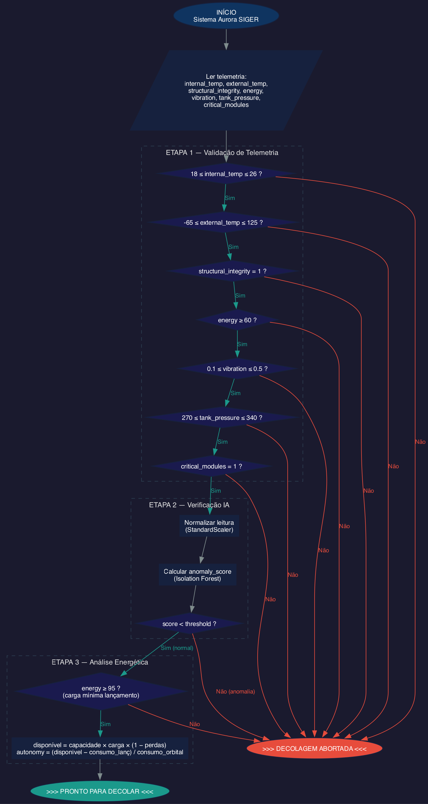

# Aurora SIGER

Sistema Inteligente de Gerenciamento de Riscos para telemetria de decolagem espacial.

> Projeto desenvolvido como atividade integradora da **Fase 1** do curso de Ciência da Computação — **FIAP (2026)**.
>
> Repositório: [github.com/Gcarmnonapy7/FIAP-Aurora-Siger](https://github.com/Gcarmnonapy7/FIAP-Aurora-Siger)

---

## O que este projeto faz?

Imagine que você faz parte da equipe de controle de missão de um foguete. Segundos antes da decolagem, dezenas de sensores estão transmitindo dados em tempo real: temperatura da cabine, pressão dos tanques de combustível, vibração dos motores, carga das baterias...

**Como saber se é seguro decolar?**

O Aurora SIGER responde a essa pergunta em **três etapas**:

1. **Validação de telemetria** — cada sensor é comparado com sua faixa segura (por exemplo, temperatura interna entre 18°C e 26°C). Se qualquer leitura estiver fora do limite, o lançamento é abortado.

2. **Verificação por Inteligência Artificial** — mesmo que todos os sensores estejam dentro da faixa, pode haver combinações sutis de valores que indicam um problema. Um modelo de **Isolation Forest** (implementado do zero!) analisa o conjunto de leituras e calcula um *anomaly score*. Se o score ultrapassar um limiar, a IA detecta a anomalia.

3. **Análise energética** — a carga das baterias é suficiente para cobrir o lançamento e manter a nave em órbita? O sistema calcula a autonomia restante considerando consumo e perdas.

Somente se as **três etapas** forem aprovadas, o sistema emite: **"PRONTO PARA DECOLAR"**. Caso contrário: **"DECOLAGEM ABORTADA"**.

---

## O que é Isolation Forest e por que usá-lo?

O **Isolation Forest** é um algoritmo de detecção de anomalias. A ideia central é simples:

> **Pontos anômalos são mais fáceis de isolar do que pontos normais.**

O algoritmo constrói árvores binárias aleatórias. Em cada nó, ele escolhe uma feature aleatória e um ponto de corte aleatório. Dados anômalos — por serem "diferentes" da maioria — tendem a ser isolados em poucas divisões (caminho curto na árvore). Dados normais precisam de muitas divisões para serem separados (caminho longo).

O **anomaly score** é derivado do comprimento médio do caminho: quanto mais curto, mais anômalo.

Neste projeto, implementamos o Isolation Forest **do zero** (classes `IsolationTreeNode`, `IsolationTree`, `MyIsolationForest`) e comparamos os resultados com a implementação do Scikit-learn, para validar que a nossa versão se comporta corretamente.

---

## Entregáveis do projeto

O notebook cobre os 6 entregáveis da atividade. Aqui está o mapeamento entre cada entregável e onde encontrá-lo:

| Entregável | Descrição | Onde no notebook |
|------------|-----------|------------------|
| **1.1** Organização da telemetria | Geração de 100k amostras sintéticas (97k normais + 3k anomalias) com 7 sensores | Cells 3–9 |
| **1.2** Algoritmo de verificação | Pseudocódigo em portugol + fluxograma do pipeline de 3 etapas | Cells 29–30 |
| **1.3** Script em Python | Classe `Validator`, funções `ai_anomaly_check()`, `calculate_autonomy()` e `launch_decision()` | Cell 28 |
| **1.4** Análise energética | Cálculo de autonomia orbital (18 kWh, perdas 14%, consumo orbital 1.2 kW) | Cell 28 + Cell 31 (ensaio) |
| **1.5** Análise assistida por IA | Isolation Forest do zero + comparação com Scikit-learn (accuracy, precision, recall, F1, ROC AUC) | Cells 20–27 |
| **1.6** Reflexão crítica | Ensaio *"Quem decide quando a máquina decide?"* — ética, automação e limites do progresso | Cell 32 |

---

## Pipeline de Machine Learning

O notebook segue este fluxo, que é o ciclo clássico de um projeto de Machine Learning:

```
DATA LOADING → EDA → FEATURE ENGINEERING → DATA SPLITTING → TRAINING → VALIDATION
     ↓          ↓           ↓                    ↓              ↓           ↓
  Gerar e    Visualizar   Normalizar       Separar 80/20    Treinar o   Comparar
  carregar   correlações  com Standard-    com estratifi-   Isolation   métricas
  os dados   e padrões    Scaler           cação            Forest      (scratch
  sintéticos                                                            vs sklearn)
```

| Etapa | O que faz | Por que é importante |
|-------|-----------|----------------------|
| **Data Loading** | Gerar 100k amostras sintéticas com distribuições realistas | Sem dados, não há modelo |
| **EDA** | Heatmap, pairplot, boxplot, distribuição, scatter 3D | Entender os dados antes de modelar evita erros |
| **Feature Engineering** | Normalizar com `StandardScaler` | O Isolation Forest é sensível à escala das features |
| **Data Splitting** | 80% treino, 20% teste, estratificado por `anomaly` | Garante que o teste reflete a proporção real de anomalias |
| **Training** | Ajustar o modelo aos dados de treino | O modelo aprende o que é "normal" |
| **Validation** | Métricas: accuracy, precision, recall, F1, ROC AUC | Saber se o modelo realmente funciona |

---

## Fluxograma — Pipeline de decisão de lançamento

O fluxograma abaixo representa o pipeline completo de decisão, com as 3 etapas (Validação de Telemetria → Verificação IA → Análise Energética):



---

## Estrutura do repositório

```
FIAP-Aurora-Siger/
├── Aurora_siger.ipynb              # Notebook principal (código, análises e resultados)
├── README.md                       # Este arquivo
├── CLAUDE.md                       # Guia para assistentes de código (Claude Code)
├── LICENSE                         # Licença do projeto
└── assets/
    ├── Aurora_siger.ipynb - Colab.pdf  # PDF com o notebook executado (todos os outputs)
    └── fluxograma_verificacao.png      # Fluxograma do pipeline de verificação pré-decolagem
```

> **Dica:** Se quiser ver os resultados sem executar o notebook, consulte o [PDF com todas as saídas](assets/Aurora_siger.ipynb%20-%20Colab.pdf).

---

## Como executar

### Opção 1 — Google Colab (recomendado)

1. Clique no badge abaixo para abrir direto no Colab:

   [](https://colab.research.google.com/github/Gcarmnonapy7/FIAP-Aurora-Siger/blob/main/Aurora_siger.ipynb)

2. Execute todas as células em sequência (`Runtime` → `Run all`)

> **Nota:** As células devem ser executadas em ordem — células posteriores dependem de variáveis criadas nas anteriores.

### Opção 2 — Localmente

```bash
# Clone o repositório
git clone https://github.com/Gcarmnonapy7/FIAP-Aurora-Siger.git
cd FIAP-Aurora-Siger

# Crie um ambiente virtual (opcional, mas recomendado)
python -m venv venv
source venv/bin/activate  # Linux/Mac
# venv\Scripts\activate   # Windows

# Instale as dependências
pip install numpy pandas seaborn matplotlib scikit-learn plotly jupyter

# Abra o notebook
jupyter notebook Aurora_siger.ipynb
```

---

## Tecnologias utilizadas

| Tecnologia | Uso no projeto |
|------------|----------------|
| Python 3 | Linguagem principal |
| NumPy | Geração de dados sintéticos e operações vetorizadas |
| Pandas | Manipulação de DataFrames (tabelas de dados) |
| Seaborn / Matplotlib | Gráficos estáticos (heatmap, boxplot, histogramas, barras) |
| Plotly | Gráficos interativos (scatter 3D com zoom e rotação) |
| Scikit-learn | Isolation Forest de referência, métricas, `StandardScaler`, `train_test_split` |
| Jupyter Notebook | Ambiente interativo que combina código, visualizações e texto |

---

## Faixas seguras de telemetria

Para decidir se é seguro decolar, cada sensor é comparado com uma **faixa segura**. Se qualquer leitura estiver fora da sua faixa, o sistema aborta o lançamento:

| Sensor | Faixa segura | O que acontece se estiver fora |
|--------|-------------|-------------------------------|
| `internal_temp` | 18–26 °C | Temperatura da cabine perigosa para a tripulação |
| `external_temp` | -65–125 °C | Exposição térmica extrema na fuselagem |
| `structural_integrity` | 1 (íntegro) | Falha estrutural detectada |
| `energy` | 60–100 % | Carga insuficiente para operação |
| `vibration` | 0.1–0.5 g | Vibração anormal nos motores |
| `tank_pressure` | 270–340 atm | Pressão de combustível fora do seguro |
| `critical_modules` | 1 (ativo) | Módulo essencial inoperante |

> **Nota:** Além desta validação por regras, existe um segundo check de `energy ≥ 95%` na **análise energética** (Etapa 3 do pipeline). Os 60% são o mínimo operacional; os 95% são o limiar Go/No-Go para lançamento.

---

## Geração dos dados sintéticos

Os dados sintéticos foram calibrados com base em referências reais de estações espaciais e veículos de lançamento. O dataset tem **100.000 amostras**: 97.000 normais e 3.000 anomalias (3%).

**Dados normais** — distribuições centradas nos valores típicos de operação:

| Coluna | μ (média) | σ (desvio) | Unidade | Referência | Comentário |
|--------|-----------|------------|---------|------------|------------|
| `internal_temp` | 22 | 1.5 | °C | ISS: 18–26°C, avg 21–23°C | Ambiente pressurizado com controle térmico ativo |
| `external_temp` | 10 | 8 | °C | LEO: -65°C a +125°C | Variação extrema entre face solar e sombra da nave |
| `structural_integrity` | — | — | 0/1 | 1 = íntegro, 0 = falha | Bernoulli(1 - failure_prob): degrada com pressão alta |
| `energy` | 98 | 2 | % | Carga pré-lançamento via GSE, Go/No-Go ≥95% | Normal(98,2) clipped [0,100] — baterias mantidas por GSE |
| `vibration` | 0.3 | 0.1 | g | Pré-decolagem: ~0.1–0.5g | Vibrações residuais dos motores em pré-ignição |
| `tank_pressure` | 305 | 15 | atm | LOX/LH2 pump-fed: 270–340 atm | Pressurização dos tanques criogênicos de LOX/LH2 |
| `critical_modules` | — | — | 0/1 | 1 = ativo, 0 = inativo | Bernoulli(1 - failure_prob): degrada com pressão alta |

**Dados anômalos** — distribuições deslocadas para simular falhas reais:

| Coluna | Diferença em relação ao normal | Motivo |
|--------|-------------------------------|--------|
| `internal_temp` | Bimodal: ~35°C ou ~5°C | Falha no controle térmico (superaquecimento ou congelamento) |
| `external_temp` | μ=60, σ=20 | Exposição solar prolongada sem rotação da nave |
| `energy` | μ=40, σ=15 | Baterias parcialmente descarregadas |
| `vibration` | μ=1.2, σ=0.4 | Vibração excessiva nos motores |
| `tank_pressure` | μ=360, σ=25 | Sobrepressurização dos tanques |
| `structural_integrity` / `critical_modules` | Probabilidade de falha muito maior | Correlacionados com sobrepressurização via função sigmoide |

### Fontes — Telemetria

- [ESA — Temperatures on the Space Station](https://www.esa.int/ESA_Multimedia/Images/2021/08/Temperatures_on_the_Space_Station)
- [Sciencing — Temperature of Outer Space Close to Earth](https://www.sciencing.com/1921895/temperature-outer-space-close-earth/)
- [NASA — LH2 Propellant Loading Model](https://c3.ndc.nasa.gov/dashlink/static/media/publication/LH2-AIAA.pdf)
- [ScienceDirect — LOX Tank Pressurisation System](https://www.sciencedirect.com/science/article/abs/pii/S1359431119381049)
- [NASA — Spacecraft Level Vibration Testing](https://ntrs.nasa.gov/api/citations/20150020490/downloads/20150020490.pdf)
- [Wikipedia — ISS Electrical System](https://en.wikipedia.org/wiki/Electrical_system_of_the_International_Space_Station)

---

## Parâmetros energéticos

Os parâmetros da análise energética (entregável 1.4) foram calibrados com base em sistemas reais de potência de espaçonaves e veículos de lançamento:

### Capacidade total das baterias (kWh)

| Sistema | Capacidade | Tipo de bateria |
|---------|------------|-----------------|
| Crew Dragon (SpaceX) | ~10–20 kWh | Li-ion (sem painéis solares durante lançamento) |
| Orion (NASA) | ~11 kWh | Li-ion (backup + picos, complementado por painéis solares) |
| Soyuz | ~5–8 kWh | Prata-zinco (módulo de descida) |
| Estágio superior Falcon 9 | ~3–5 kWh | Li-ion |
| ISS (referência) | ~600 kWh | Li-ion (48 unidades, upgrade 2017–2021) |

**Valor na simulação:** 18 kWh (sistema combinado cápsula + estágio superior)

### Carga pré-lançamento e limiar Go/No-Go

- Baterias mantidas a **100%** via Ground Support Equipment (GSE) até desconexão do umbilical (T-2 a T-5 min)
- Carga no momento da desconexão: **~98–100%**
- Limiar mínimo Go/No-Go: **≥95%** (missões tripuladas: ≥97%)

### Consumo elétrico durante a fase de lançamento

| Subsistema | Consumo (W) | Notas |
|------------|-------------|-------|
| Computadores de bordo (redundantes) | 200–600 | Tripla redundância (ex: Falcon 9 usa 3× flight computers) |
| Navegação e controle (GNC) | 100–300 | IMUs, star trackers, receptores GPS |
| Comunicação e telemetria | 100–400 | Downlink S-band/C-band, range safety |
| Atuadores de válvulas e controle de motor | 200–800 | Pico durante eventos de staging |
| Instrumentação e sensores | 50–200 | Pressão, temperatura, vibração |
| Circuitos pirotécnicos | 50–200 (pico) | Separação de estágios, ejeção de carenagem |
| Controle ambiental (tripulado) | 200–500 | Ventiladores, bombas de refrigeração |
| **Total (veículo tripulado)** | **~1.5–3.0 kW** | |

- Duração da fase de lançamento: ~8–10 min até inserção orbital
- Energia elétrica total consumida: **~0.30 kWh**
- Picos de potência (staging): **3–5 kW** por alguns segundos
- Barramento padrão: **28 VDC** (MIL-STD-704)

### Consumo orbital (pós-lançamento)

Em órbita, atuadores de motor e pirotécnicos estão inativos, reduzindo o consumo para **~0.8–1.5 kW** (~50–65% do lançamento):

| Subsistema | Lançamento (W) | Órbita (W) | Notas |
|------------|---------------|------------|-------|
| Computadores de bordo | 200–600 | 200–400 | Mesma redundância, menor carga computacional |
| GNC | 100–300 | 50–150 | Modo cruzeiro, sem correções agressivas |
| Comunicação/telemetria | 100–400 | 100–300 | Downlink contínuo a menor taxa |
| Atuadores/controle de motor | 200–800 | **0** | Motores desligados |
| Pirotécnicos | 50–200 | **0** | Já utilizados no staging |
| Controle ambiental | 200–500 | 200–500 | Mantém-se (suporte de vida) |
| Gerenciamento térmico | — | 100–300 | Aumenta (ciclos sol/sombra ~90 min) |

**Valor na simulação:** 1.2 kW (Crew Dragon free-flight: ~1.0–1.2 kW)

### Cálculo de autonomia

```
energia_útil       = capacidade × carga% × (1 - perdas%)     → 18 × 1.0 × 0.86 = 15.48 kWh
energia_lançamento = consumo_kw × duração_min / 60            → 2.0 × 9/60       = 0.30 kWh
autonomia_orbital  = (energia_útil - energia_lançamento) / consumo_orbital
                   = (15.48 - 0.30) / 1.2 = 12.65 horas
```

### Perdas energéticas

| Tipo de perda | % típica | Descrição |
|---------------|----------|-----------|
| Resistência interna da bateria | 2–5% | Perdas I²R, maiores em altas taxas de descarga |
| Conversão DC-DC | 3–8% | Conversores para barramentos secundários (5V, 12V) com 92–97% de eficiência |
| Resistência de cabeamento | 1–3% | Chicotes elétricos de 100+ metros em alumínio/cobre |
| Gerenciamento térmico | 2–5% | Aquecedores de bateria e sistemas de refrigeração |
| Condicionamento de potência | 1–2% | Reguladores de tensão, filtros, circuitos de proteção |
| **Total combinado** | **~8–18%** | **Valor na simulação: 14%** |

### Fontes — Energia

- Wertz, J. R., Everett, D. F. & Puschell, J. J. — *Space Mission Engineering: The New SMAD* (Cap. 11 — Power Systems)
- Patel, M. R. — *Spacecraft Power Systems* (CRC Press)
- [NASA — ISS Li-ion Battery Upgrade Fact Sheet](https://www.nasa.gov/mission_pages/station/research/benefits/iss-battery-upgrade)
- [SpaceX — Crew Dragon Press Kit (Demo-2)](https://www.spacex.com/launches/)
- [MIL-STD-704F — Aircraft/Spacecraft Electrical Power Characteristics](https://quicksearch.dla.mil/qsDocDetails.aspx?ident_number=36237)
- [ESA — Soyuz Crew Training Manual (Electrical Systems)](https://www.esa.int/Science_Exploration/Human_and_Robotic_Exploration/International_Space_Station)
- [ULA — Atlas V / Centaur User's Guide](https://www.ulalaunch.com/docs/default-source/rockets/atlasv-usersguide2010a.pdf)

---

## Autores

| Nome | RM | Contato |
|------|----|---------|
| Gabriel Carmona Bittencourt | RM569239 | gabrielcarmonabittencourtpy@gmail.com |
| Samuel Felipe Furtado Freire | RM572777 | nekolorful@gmail.com |
| Marcio Francisco dos Santos Junior | RM570758| marciofsantos65@gmail.com |
| Iúri Leão de Almeida | RM570215 | iurileao@gmail.com |
| Miguel Moreira | RM572409 | miguelitomoreiraa2008@gmail.com |

---

## Licença

Distribuído sob a licença MIT. Veja [LICENSE](LICENSE) para mais detalhes.
